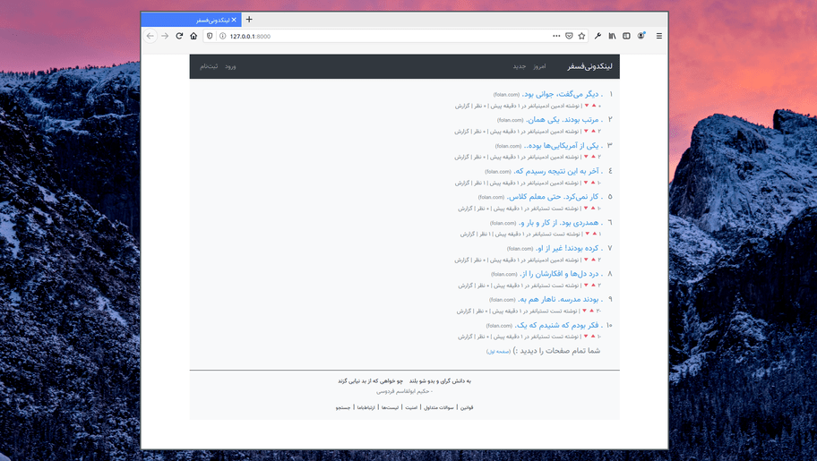

# FOSS4News

Just a simple clone of The Hacker News based on [Laravel Framework](https://laravel.com/docs/7.x/) and [Bootstrap4](https://getbootstrap.com/docs/4.4/getting-started/introduction/),which is in alpha stage. The project has been released in Persian/Farsi language. We are planning additional languages in the future.

> این صفحه را به فارسی در [اینجا](doc/README_FA.md) مشاهده کنید

## Run

before run this project you need to install docker & docker-compose.

1. Clone project.

   `git clone https://github.com/sadraiiali/FOSS4News.git && cd FOSS4News`

2. Make `.env` file from `.env.example` with your configs.

    `cp src/.env.example src/.env`

3. Modify Mysql variables form `docker-compose.yml` and match with `.env` file.

4. Run `./RunFirstTime.sh`.

    `bash ./RunFirstTime.sh`

5. Create your account then login with default Admin then make your account admin! (you can remove default users)
   
    `Default Admin : admin@admin.com:adminadmin`
    
    `Default User : test@test.com:testtest`
    
    Done :)
    
    

## License

The main code is licensed under [GPLv3](https://github.com/sadraiiali/FOSS4News/blob/master/LICENSE).

## Contribute

Feel free to clone project, add your code and then submit a pull request. Any participate is willing :)

## Maintainers

- [Alireza Sadraii Rad](https://github.com/sadraiiali/)
- [Mehran](https://github.com/meh666ran)